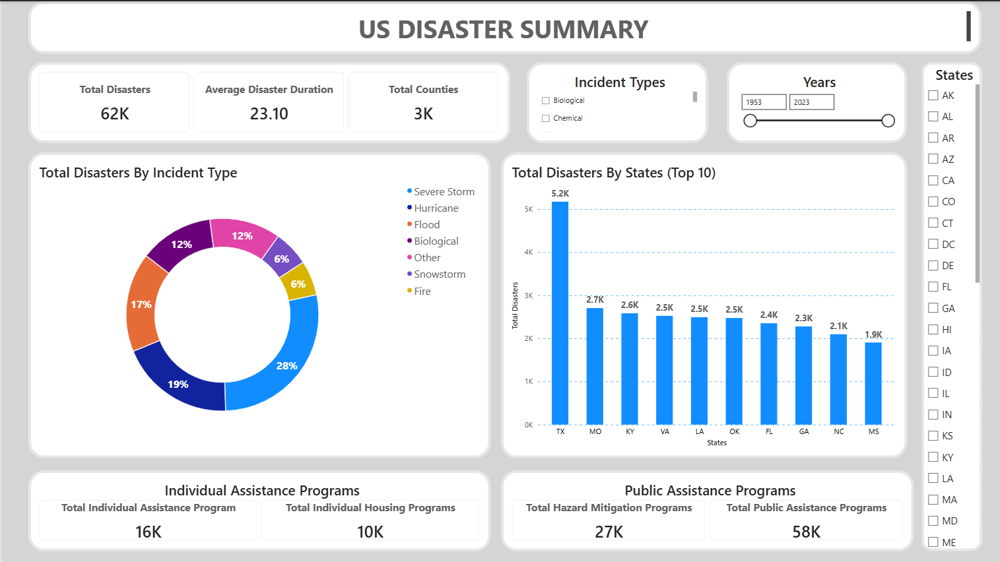
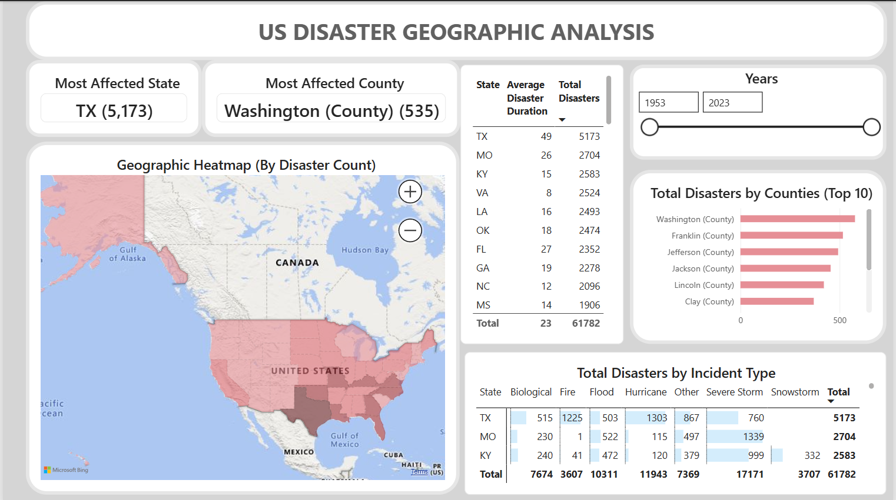
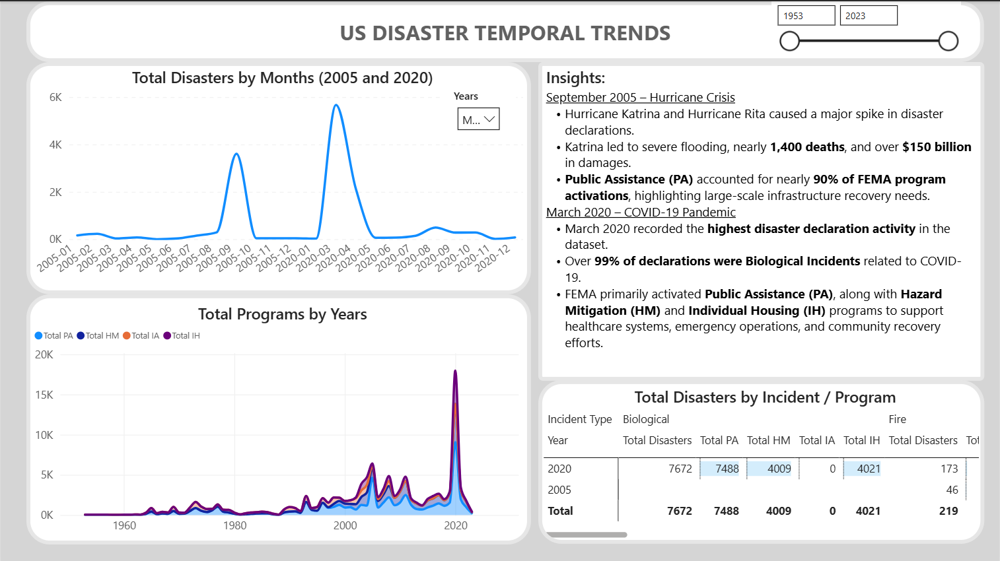
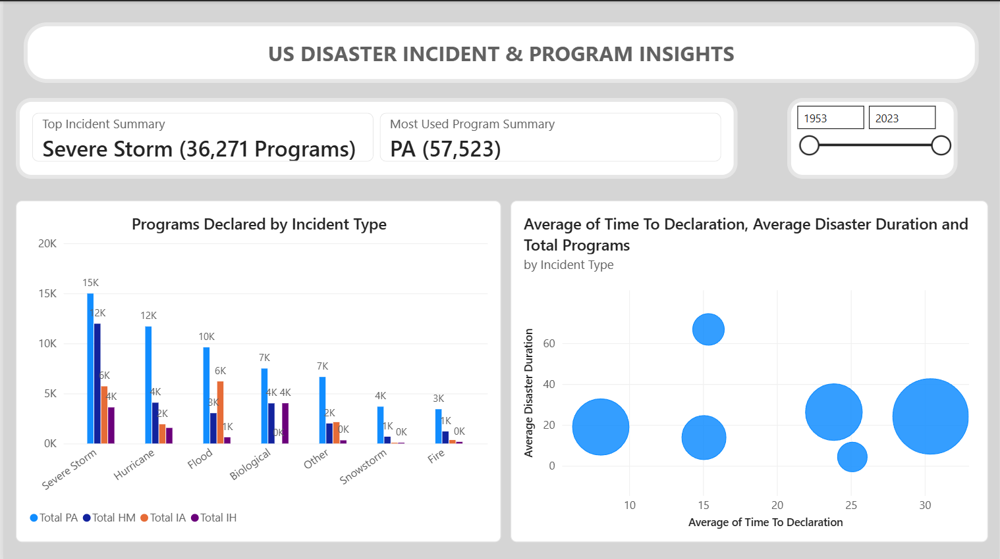
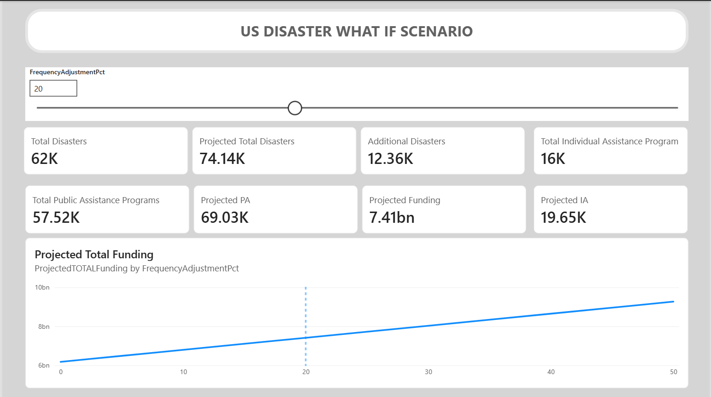

# US Disaster Declarations Dashboard

## 📌 Project Overview

The **US Disaster Declarations Dashboard** is an interactive Power BI analytics solution developed using FEMA Disaster Declaration data. The dashboard provides decision-makers with insights into disaster trends, geographic impact, FEMA assistance programs, and future disaster scenarios through interactive visualizations and What-If analysis.

This project was developed as a **Data Analytics Capstone Project** by a team of five members using Microsoft Power BI.

---

# 🎯 Project Objectives

- Analyze disaster declarations across the United States.
- Identify disaster-prone states and counties.
- Explore temporal trends and seasonal disaster patterns.
- Evaluate FEMA assistance program utilization.
- Measure disaster response timelines.
- Simulate future disaster scenarios using What-If analysis.

---

# 📂 Dataset

**Source:** FEMA Open Disaster Declarations Data

The dataset includes:

- Disaster Number
- State
- County (Designated Area)
- Declaration Date
- Incident Begin Date
- Incident End Date
- Incident Type
- Declaration Type
- FIPS Codes
- FEMA Assistance Programs
  - Individual Assistance (IA)
  - Public Assistance (PA)
  - Hazard Mitigation (HM)
  - Individual Housing (IH)

---

# 🧹 Data Preparation

Data preprocessing was performed using **Power Query Editor**.

### Cleaning & Transformation

- Standardized date formats
- Removed duplicate records
- Corrected data types
- Standardized state names and categories
- Validated FIPS codes
- Created a Date Table
- Established relationships for time intelligence
- Created calculated columns for:
  - Disaster Duration
  - Time to Declaration
  - Year
  - Month
  - Quarter
  - Decade

---

# 📊 Dashboard Pages

## 1️⃣ Overview

Provides a high-level summary of FEMA disaster declarations.

### KPIs

- Total Disasters
- Average Disaster Duration
- Average Time to Declaration
- Individual Assistance (IA)
- Public Assistance (PA)
- Hazard Mitigation (HM)

### Visuals

- Disaster distribution by Incident Type
- Disaster distribution by State
- Interactive slicers

---

## 2️⃣ Geographic Analysis

Analyzes disaster distribution across the United States.

### Features

- Filled Map of Disaster Declarations
- Most Affected State
- Most Affected County
- Top State & County Disaster Counts
- State Ranking Table
- Geographic Heatmap
- County-Level Analysis

---

## 3️⃣ Temporal Trends

Explores disaster patterns over time.

### Features

- Monthly Disaster Trend
- Program Declaration Trend
- Incident Trend Analysis
- Seasonal Heatmap
- Peak Disaster Month
- Year-over-Year Analysis

---

## 4️⃣ Incident & Program Insights

Examines relationships between disaster types and FEMA assistance programs.

### Features

- Incident Type Comparison
- FEMA Program Distribution
- Average Disaster Duration by Incident
- Disaster Duration vs Time to Declaration (Scatter Plot)
- Most Used FEMA Program
- Program Analysis Matrix

---

## 5️⃣ Scenario Insights

Provides interactive disaster forecasting using Power BI What-If Parameters.

### Features

- Disaster Frequency Adjustment Slider
- Projected Disaster Count
- Additional Disaster Estimation
- Projected FEMA Program Requirements
- Funding Projection
- Scenario Comparison

---

# 📈 Key Insights

### 🌪 September 2005 – Hurricane Crisis

- Hurricane Katrina and Hurricane Rita caused a significant spike in disaster declarations.
- Public Assistance (PA) accounted for nearly **90%** of FEMA program activations, reflecting extensive infrastructure recovery efforts.

### 🦠 March 2020 – COVID-19 Pandemic

- March 2020 recorded the highest disaster declaration activity in the dataset.
- Over **99%** of declarations were classified as **Biological Incidents** related to COVID-19.
- FEMA primarily activated **Public Assistance (PA)**, along with **Hazard Mitigation (HM)** and **Individual Housing (IH)** programs to support nationwide emergency response and recovery.

---

# 🛠 Technologies Used

- Microsoft Power BI Desktop
- Power Query
- DAX (Data Analysis Expressions)
- Power BI Maps
- Power BI What-If Parameters
- GitHub

---

# 📁 Repository Structure

```
📦 US-Disaster-Declarations-Dashboard
│
├── README.md
├── Capstone_Group_Project.pbix
├── Dataset
│   ├── us_disaster_declarations.csv
├── Images
│   ├── Overview.png
│   ├── Geographic_Analysis.png
│   ├── Temporal_Trends.png
│   ├── Incident_Program_Insights.png
│   └── Scenario_Insights.png
└── Documentation
    ├── Technical_Documentation.pdf
    └── Project_Presentation.pdf
```

---

# 🚀 Future Enhancements

- Integrate live FEMA API data for real-time updates.
- Include disaster-related economic loss and funding data.
- Develop predictive models for disaster forecasting.
- Enhance drill-through capabilities for county-level insights.
- Optimize the dashboard for mobile devices.

---

# 👥 Team Members

- Sarvesh Mehta
- Priyanka Prabhu
- Subhra Pradhan
- Dipti Gargow

---

# Dashboard Preview

## Overview


## Geographic Analysis


## Temporal Trends


## Incident & Program Insights


## Scenario Insights


---

# 📄 License

This project was created for educational purposes as part of a Data Analytics Capstone Project. FEMA disaster data is publicly available through official U.S. government sources.
